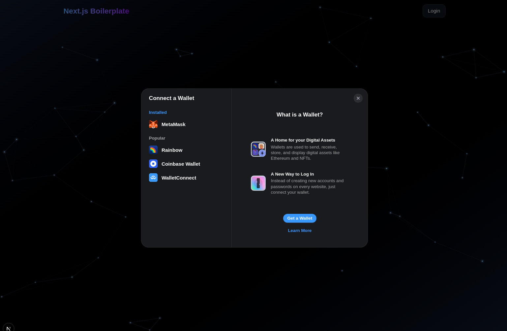
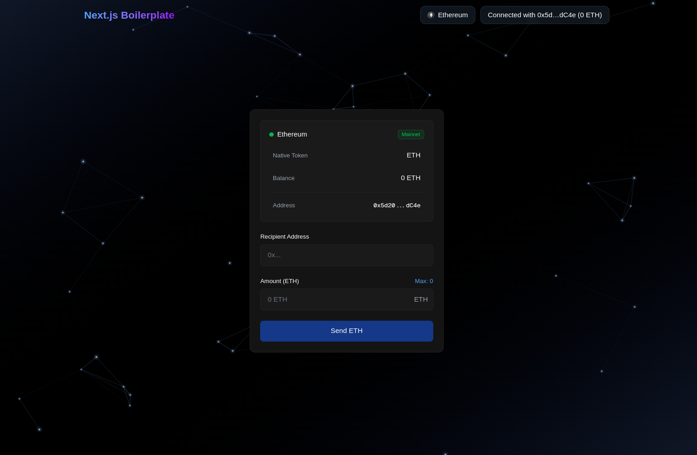

# Next.js Web3 Boilerplate 🚀

<br/>




<br/>

### A modern boilerplate for building Web3 applications with Next.js 15, Wagmi v3, RainbowKit and Viem. 🚀 
### Multi-wallet support 
### EVM chains support

<br/>

## 📑 Table of Contents

- [Features](#-features)
- [Technologies](#-technologies)
- [Quick Start](#-quick-start)
- [Configuration](#-configuration)
  - [Environment Variables](#environment-variables)
  - [Network Configuration](#network-configuration)
  - [Supported Networks](#supported-networks)
  - [Supported Wallets](#supported-wallets)
  - [Adding a New Network](#adding-a-new-network)
- [Hook for Wallet Info and Transaction Management](#core-hooks)
- [Beginner's Guide](#-beginners-guide)
  - [Understanding Ethereum Networks](#understanding-ethereum-networks)
  - [Setting up Infura](#setting-up-infura)
  - [Finding Network Information](#finding-network-information)

<br/>

## 🌟 Features

- ⚡️ **Next.js 15**
- 🎨 **TailwindCSS**
- 🔐 **Web3 Authentication** with RainbowKit
- 🔄 **Global State** with Wagmi v3
- 🌐 **Multi-network Support**
- 🌈 **Multiple Wallet Support**
- 🎯 **Type-Safe** with TypeScript
- 🔌 **Easy Network Configuration**
- 📊 **Wallet Information and Transaction Management**

## 🛠 Technologies

- [Next.js 15](https://nextjs.org/)
- [RainbowKit](https://www.rainbowkit.com/)
- [Wagmi v3](https://wagmi.sh/)
- [Viem](https://viem.sh/)
- [TailwindCSS](https://tailwindcss.com/)
- [TypeScript](https://www.typescriptlang.org/)

<br/>

## 🚀 Quick Start

```bash
# Clone the repo
git clone https://github.com/MathysCogne/nextjs_boilerplate_web3-auth_metamask

# Install dependencies
pnpm install

# Start development server
pnpm dev
```

### Enjoying my boilerplate ? Show your love with a star ! 🌟🌟🌟


<br/>

## 🔧 Configuration

### Environment Variables

Create a `.env` file at the root of your project:

```bash
# Required API Keys
NEXT_PUBLIC_INFURA_API_KEY = your_api_key_infura
NEXT_PUBLIC_WALLET_CONNECT_PROJECT_ID = your_wallet_connect_project_id
```

<br/>

### Network Configuration

The application supports multiple networks out of the box. All network configuration is centralized in `lib/constants.ts`:

```typescript
// Network Configuration
export const NETWORKS = {
  MAINNET: {
    ...mainnet,
    rpc: `https://mainnet.infura.io/v3/${INFURA_API_KEY}`,
  },
  ARBITRUM: {
    ...arbitrum,
    rpc: `https://arbitrum-mainnet.infura.io/v3/${INFURA_API_KEY}`,
  },
  // Add more networks here
} as const;

// Network Grouping
export const CHAINS = {
  MAINNETS: [
    NETWORKS.MAINNET,
    NETWORKS.ARBITRUM,
    // ...other mainnet networks
  ],
  TESTNETS: [
    NETWORKS.SEPOLIA,
    NETWORKS.GOERLI,
    // ...other testnet networks
  ],
} as const;
```

### Supported Networks

#### Mainnets
- Ethereum
- Arbitrum
- Optimism
- Polygon
- Base
- Linea
- Celo
- Avalanche

#### Testnets
- Sepolia
- Goerli
- Arbitrum Sepolia
- Optimism Sepolia
- Polygon Mumbai
- Base Goerli
- Linea Testnet
- Celo Alfajores

### Supported Wallets

RainbowKit provides support for numerous wallets out of the box:
- MetaMask
- WalletConnect
- Coinbase Wallet
- Rainbow
- Trust Wallet
- Ledger
- and many more...

<br/>

### Adding a New Network

To add support for a new network:

1. **Import the Chain**
   ```typescript
   import { newChain } from 'wagmi/chains';
   ```

2. **Add Network Configuration**
   In `lib/constants.ts`:
   ```typescript
   export const NETWORKS = {
     // ... existing networks
     NEW_NETWORK: {
       ...newChain,
       rpc: `https://new-network.infura.io/v3/${INFURA_API_KEY}`,
     },
   } as const;
   ```

3. **Add to Chain Groups**
   ```typescript
   export const CHAINS = {
     MAINNETS: [
       // ... existing mainnets
       NETWORKS.NEW_NETWORK, // if it's a mainnet
     ],
     TESTNETS: [
       // ... existing testnets
       NETWORKS.NEW_NETWORK, // if it's a testnet
     ],
   } as const;
   ```

The configuration will automatically handle:
- RPC Endpoints
- Chain Information
- Network Switching
- Explorer Links
- Network Information Display

<br/>

## Core Hooks

### useTransaction Hook

The `useTransaction` hook provides a comprehensive solution for handling cryptocurrency transactions:

```typescript
const {
  input,              // Transaction input state
  setInput,           // Input state setter
  networkConfig,      // Current network configuration
  validation,         // Input validation state
  isPending,          // Transaction pending state
  isConfirming,       // Transaction confirming state
  isConfirmed,        // Transaction confirmed state
  handleSend,         // Transaction sender function
  hash,              // Transaction hash
  sendError,         // Send error state
  confirmError,       // Confirmation error state
  walletInfo         // Wallet information
} = useTransaction();
```

### useWalletInfo Hook

The `useWalletInfo` hook provides centralized access to wallet information:

```typescript
const {
  status,            // Wallet connection status
  address,           // Wallet address
  chain,             // Current chain information
  balance            // Wallet balance
} = useWalletInfo();
```

These hooks are designed to work together to provide a seamless Web3 experience.

<br/>


## 📚 Beginner's Guide

### Required API Keys

To get started with this boilerplate, you'll need two essential API keys:

1. **WalletConnect Project ID**:
   - Visit [WalletConnect Cloud](https://cloud.walletconnect.com/sign-in)
   - Create an account and new project
   - Add your project ID to your `.env` as `NEXT_PUBLIC_WALLET_CONNECT_PROJECT_ID`

2. **Infura API Key**:
   - Visit [Infura](https://app.infura.io/register)
   - Create an account and Go to "Create New Key" in your dashboard
   - Add it to your `.env` as `NEXT_PUBLIC_INFURA_API_KEY`

### Understanding Our Network Setup

Our boilerplate uses a centralized network configuration in `lib/constants.ts`. Here's how it works:

#### Network Structure
```typescript
// Example of our network configuration
export const NETWORKS = {
  MAINNET: {
    ...mainnet,
    rpc: `https://mainnet.infura.io/v3/${INFURA_API_KEY}`,
  },
  // Other networks...
}
```

#### Supported Networks Out of the Box

1. **Mainnets** (Real transactions, real value):
   - Ethereum (Chain ID: 1)
   - Arbitrum (Chain ID: 42161)
   - Optimism (Chain ID: 10)
   - Polygon (Chain ID: 137)
   - Base (Chain ID: 8453)
   - Linea (Chain ID: 59144)
   - Celo (Chain ID: 42220)
   - Avalanche (Chain ID: 43114)

2. **Testnets** (Development & Testing):
   - Sepolia (Chain ID: 11155111)
   - Goerli (Chain ID: 5)
   - Arbitrum Sepolia (Chain ID: 421614)
   - Optimism Sepolia (Chain ID: 11155420)
   - Polygon Mumbai (Chain ID: 80001)
   - Base Goerli (Chain ID: 84531)
   - Linea Testnet (Chain ID: 59140)
   - Celo Alfajores (Chain ID: 44787)

### Getting Test Tokens

For development, you'll need test tokens. Here's how to get them:

1. **Sepolia ETH**:
   - Visit [Sepolia Faucet](https://sepoliafaucet.com)
   - Connect with Alchemy account
   - Request test ETH

2. **Mumbai MATIC**:
   - Visit [Mumbai Faucet](https://faucet.polygon.technology)
   - Select Mumbai network
   - Request test MATIC

3. **Other Networks**:
   - Arbitrum Goerli: [Arbitrum Faucet](https://faucet.arbitrum.io)
   - Optimism Goerli: [Optimism Faucet](https://faucet.optimism.io)
   - Base Goerli: [Base Faucet](https://faucet.base.org)

### Wallet Setup

Our boilerplate supports multiple wallets through RainbowKit. Here's how to get started:

1. **MetaMask** (Recommended for development):
   - Install [MetaMask](https://metamask.io/download)
   - Create or import a wallet
   - Switch to a testnet network (e.g., Sepolia)

2. **Other Supported Wallets**:
   - WalletConnect: No installation needed
   - Coinbase Wallet: [Download](https://www.coinbase.com/wallet)
   - Rainbow: [Download](https://rainbow.me)

### Development Tips

1. **Start with Testnets**:
   - Use Sepolia for Ethereum development
   - Use Mumbai for Polygon development
   - Always test on testnets before mainnet

2. **Network Switching**:
   - Our configuration handles network switching automatically
   - Users will be prompted to switch networks when needed
   - Network data is configured in `lib/constants.ts`

3. **Environment Setup**:
   ```bash
   # Required in .env
   NEXT_PUBLIC_INFURA_API_KEY=your_infura_project_id
   NEXT_PUBLIC_WALLET_CONNECT_PROJECT_ID=your_walletconnect_project_id
   ```

### Understanding Networks: Mainnet vs Testnet

#### What is a Mainnet?
A mainnet (main network) is the primary blockchain network where actual transactions occur:
- Real cryptocurrency with real monetary value
- Actual gas fees must be paid for transactions
- Used for production applications
- Transactions are irreversible
- Examples: Ethereum Mainnet, Polygon Mainnet

#### What is a Testnet?
A testnet (test network) is a blockchain network that simulates the mainnet:
- Test cryptocurrencies with no real value
- Free test tokens available from faucets
- Used for development and testing
- Safe environment for testing smart contracts
- Examples: Sepolia, Mumbai


### Finding Chain IDs and RPC Endpoints

There are several reliable sources to find network information:

1. **Official Sources**:
   - [Chainlist](https://chainlist.org) - Browse and connect to EVM networks
   - [Ethereum Chain IDs](https://chainid.network) - Official registry
   - [Infura Documentation](https://docs.infura.io/networks) - RPC endpoints for supported networks

2. **How to Find Chain Information**:

   a) Using Chainlist:
   - Visit [Chainlist](https://chainlist.org)
   - Search for your network (e.g., "Polygon")
   - Find:
     - Chain ID
     - RPC URL
     - Currency Symbol
     - Block Explorer URL

   b) Using Network Documentation:
   - [Ethereum](https://ethereum.org/developers/docs/networks)
   - [Polygon](https://wiki.polygon.technology/docs/develop/network-details/network)
   - [Arbitrum](https://developer.arbitrum.io/network-information)
   - [Optimism](https://docs.optimism.io/chain-operators/networks)

3. **RPC URL Formats for Our Supported Networks**:
   ```typescript
   // Infura RPC URL Pattern
   Ethereum: https://mainnet.infura.io/v3/${INFURA_API_KEY}
   Polygon: https://polygon-mainnet.infura.io/v3/${INFURA_API_KEY}
   Optimism: https://optimism-mainnet.infura.io/v3/${INFURA_API_KEY}
   Arbitrum: https://arbitrum-mainnet.infura.io/v3/${INFURA_API_KEY}
   ```

4. **Quick Reference for Common Networks**:
   ```typescript
   // Mainnets
   Ethereum:  { chainId: 1,      symbol: 'ETH'   }
   Polygon:   { chainId: 137,    symbol: 'MATIC' }
   Arbitrum:  { chainId: 42161,  symbol: 'ETH'   }
   Optimism:  { chainId: 10,     symbol: 'ETH'   }

   // Testnets
   Sepolia:   { chainId: 11155111, symbol: 'ETH'   }
   Mumbai:    { chainId: 80001,    symbol: 'MATIC' }
   ```

<br/>

<br/>